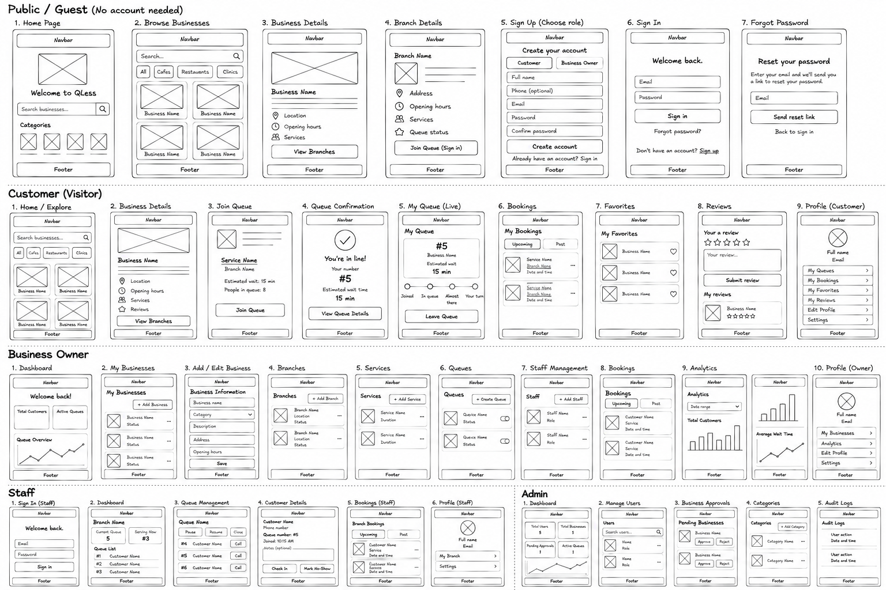
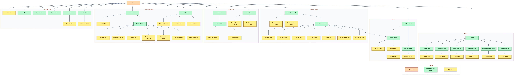

# QLess

QLess is a full-stack virtual queue management platform that allows customers to join queues remotely instead of waiting physically at a business.

Customers can browse businesses, choose a branch and service, join a virtual queue, track their position in real time, view their estimated waiting time, and receive notifications when their turn approaches.

The platform also includes dedicated interfaces for business owners, staff members, and administrators to manage businesses, branches, services, queues, bookings, customers, and platform activity.

## Background

QLess was created to reduce the time people spend physically waiting in queues.

Traditional queues require customers to remain at a location until their turn arrives. QLess allows customers to join remotely, receive a queue number, monitor their position, and return when their turn is approaching.

At the same time, businesses can manage customer flow, operate queues, organize branches and services, and monitor queue activity from one platform.

## Features

- User registration and login
- JWT authentication
- Role-based access
- Guest business browsing
- Search businesses
- Filter businesses by category
- View business details
- View branches and branch information
- View branch operating hours
- View available services
- View queue status
- Join virtual queues remotely
- Receive a queue number
- Track queue position
- View people ahead
- View estimated waiting time
- View recommended return time
- Real-time queue updates using WebSockets
- Receive notifications when a turn approaches
- Mark "On the way"
- Customer check-in
- Leave or cancel a queue
- View active and previous queue tickets
- No-show warnings and temporary restrictions
- Service bookings
- Customer reviews
- Favorite businesses
- Business management
- Branch management
- Service management
- Operating hours management
- Queue management
- Queue analytics
- Staff management
- Announcement management
- Owner queue control
- Staff queue control
- Admin dashboard
- User management
- Business approval and rejection
- Category management
- Queue monitoring
- Review moderation
- Suspicious activity monitoring
- Audit logs

## User Stories

### Guest User Stories

- As a guest, I can view the landing page explaining how QLess works.
- As a guest, I can browse approved businesses.
- As a guest, I can search for businesses.
- As a guest, I can filter businesses by category.
- As a guest, I can view the details of a business.
- As a guest, I can view the branches of a business.
- As a guest, I can view branch addresses and contact information.
- As a guest, I can view branch operating hours.
- As a guest, I can see whether a branch is currently open.
- As a guest, I can view services available at a branch.
- As a guest, I can view available queues and their status.
- As a guest, I can view business announcements.
- As a guest, I can sign up for an account.
- As a guest, I can log in to my account.

### Customer User Stories

- As a customer, I can log in to my account.
- As a customer, I can log out of my account.
- As a customer, I can browse businesses.
- As a customer, I can search for businesses.
- As a customer, I can filter businesses by category.
- As a customer, I can view business details.
- As a customer, I can choose a branch.
- As a customer, I can view branch services and queues.
- As a customer, I can join an open queue.
- As a customer, I can receive a queue number.
- As a customer, I can see how many people are ahead of me.
- As a customer, I can see my current queue position.
- As a customer, I can view my estimated waiting time.
- As a customer, I can view my recommended return time.
- As a customer, I can receive real-time queue updates.
- As a customer, I can receive notifications about my queue.
- As a customer, I can see when I have been called.
- As a customer, I can mark that I am on my way.
- As a customer, I can check in after being called.
- As a customer, I can leave a queue.
- As a customer, I can view my active and previous queue tickets.
- As a customer, I can receive a warning after a no-show.
- As a customer, I can see when my account is temporarily restricted.
- As a customer, I can make a service booking.
- As a customer, I can view my bookings.
- As a customer, I can update a booking.
- As a customer, I can cancel a booking.
- As a customer, I can review a business after completing a service.
- As a customer, I can edit my own review.
- As a customer, I can delete my own review.
- As a customer, I can favorite a business.
- As a customer, I can remove a business from my favorites.
- As a customer, I can view my favorite businesses.
- As a customer, I can view business announcements.

### Business Owner User Stories

- As a business owner, I can create a business.
- As a business owner, I can view my businesses.
- As a business owner, I can submit a business for admin approval.
- As a business owner, I can view the approval status of my business.
- As a business owner, I can see the reason my business was rejected.
- As a business owner, I can edit my business information.
- As a business owner, I can resubmit a rejected business.
- As a business owner, I can deactivate my business.
- As a business owner, I can create multiple branches.
- As a business owner, I can edit branch information.
- As a business owner, I can deactivate a branch.
- As a business owner, I can manage branch addresses and contact information.
- As a business owner, I can add services to a branch.
- As a business owner, I can edit services.
- As a business owner, I can deactivate services.
- As a business owner, I can configure operating hours.
- As a business owner, I can create queues.
- As a business owner, I can configure queue capacity.
- As a business owner, I can configure average service duration.
- As a business owner, I can configure the no-show grace period.
- As a business owner, I can open a queue.
- As a business owner, I can pause a queue.
- As a business owner, I can resume a queue.
- As a business owner, I can close a queue.
- As a business owner, I can view customers waiting in a queue.
- As a business owner, I can see which customers are on their way.
- As a business owner, I can call the next customer.
- As a business owner, I can check in a customer.
- As a business owner, I can mark a customer as completed.
- As a business owner, I can mark a customer as a no-show.
- As a business owner, I can manage staff members.
- As a business owner, I can view branch bookings.
- As a business owner, I can confirm or complete bookings.
- As a business owner, I can create announcements.
- As a business owner, I can edit announcements.
- As a business owner, I can deactivate announcements.
- As a business owner, I can view customer reviews.
- As a business owner, I can view queue analytics.

### Staff User Stories

- As a staff member, I can log in and log out.
- As a staff member, I can view my assigned business.
- As a staff member, I can view my assigned branch.
- As a staff member, I can view branch services and operating hours.
- As a staff member, I can view queues belonging to my branch.
- As a staff member, I can view customers waiting in a queue.
- As a staff member, I can see which customers are on their way.
- As a staff member, I can call the next customer.
- As a staff member, I can check in a customer.
- As a staff member, I can mark a customer as completed.
- As a staff member, I can mark a customer as a no-show.
- As a staff member, I can pause a queue.
- As a staff member, I can resume a queue.
- As a staff member, I can view queue history.
- As a staff member, I can view branch bookings.
- As a staff member, I can confirm or complete bookings.

### Admin User Stories

- As an admin, I can access an admin dashboard.
- As an admin, I can view platform statistics.
- As an admin, I can view all users.
- As an admin, I can activate or deactivate user accounts.
- As an admin, I can lift a customer's temporary restriction.
- As an admin, I can view all businesses.
- As an admin, I can view pending business applications.
- As an admin, I can approve a business.
- As an admin, I can reject a business.
- As an admin, I can deactivate a business.
- As an admin, I can view business branches.
- As an admin, I can activate or deactivate branches.
- As an admin, I can manage business categories.
- As an admin, I can monitor queues.
- As an admin, I can view reviews.
- As an admin, I can remove inappropriate reviews.
- As an admin, I can monitor suspicious activity.
- As an admin, I can mark suspicious activity as reviewed or dismissed.
- As an admin, I can view audit logs.

## Planning Materials

### Wireframes



### Component Hierarchy Diagram



### Entity Relationship Diagram


## Frontend

The frontend is built with React and provides the user interface for guests, customers, business owners, staff members, and administrators.

The application uses reusable React components, React Context for authentication state, React Router for navigation and protected routes, and service files for communication with the backend API.

WebSockets are used to provide real-time queue updates without requiring customers to manually refresh the page.

## Authentication

QLess uses JWT-based authentication to protect user accounts and role-specific application features.

- Users can sign up and sign in.
- Authentication state is managed on the frontend.
- JWT tokens are used for authenticated API requests.
- Protected routes require the user to be signed in.
- Customer features are restricted to customer accounts.
- Business management features are restricted to business owners.
- Queue operation features are available to authorized owners and staff.
- Admin features are restricted to users with an admin role.
- Users can log out from the application.

## API Integration

The frontend communicates with the QLess FastAPI backend through RESTful API endpoints.

The API is used to manage:

- Authentication
- User accounts
- Businesses
- Branches
- Categories
- Services
- Operating hours
- Queues
- Queue entries
- Bookings
- Notifications
- Reviews
- Favorites
- Staff
- Announcements
- Queue analytics
- Admin monitoring
- Suspicious activity
- Audit logs

WebSockets are used for real-time queue position and status updates.

## Technologies Used

### Frontend

- React
- JavaScript
- HTML
- CSS
- React Router
- React Context API
- Vite
- WebSockets
- Phosphor Icons

### Backend

- Python
- FastAPI
- SQLAlchemy
- PostgreSQL
- Alembic
- Pydantic
- JWT
- WebSockets

### Development Tools

- Git
- GitHub
- npm
- Postman
- Uvicorn

## Getting Started

### Prerequisites

- Node.js and npm installed
- Git installed
- QLess backend API running locally or deployed online

### Installation

Clone the repository:

```bash
git clone https://github.com/fatema-maitham/QLess-Frontend.git
```

Navigate into the project folder:

```bash
cd QLess-Frontend
```

Install dependencies:

```bash
npm install
```

Create a `.env` file in the project root:

```bash
touch .env
```

Add the backend URLs:

```env
VITE_API_URL=http://127.0.0.1:8000/api
VITE_WS_URL=ws://127.0.0.1:8000/ws
```

Start the development server:

```bash
npm run dev
```

The application will normally be available at:

```text
http://localhost:5173
```

### Build for Production

To create a production build:

```bash
npm run build
```

To preview the production build locally:

```bash
npm run preview
```

### Test Accounts

Seeded accounts use the password:

```text
password123
```

| Role | Email |
| --- | --- |
| Admin | `admin@qless.com` |
| Business Owner | `owner@qless.com` |
| Staff | `staff@qless.com` |
| Customer | `customer@qless.com` |

## Backend Repository

[QLess Backend Repository](https://github.com/fatema-maitham/QLess-Backend)

## Deployed Website

[QLess](ADD_DEPLOYED_WEBSITE_LINK_HERE)

## Attributions

- General Assembly course materials and starter code
- React documentation
- React Router documentation
- Vite documentation
- FastAPI documentation
- Phosphor Icons

## Future Enhancements

- SMS notifications when a customer's turn is near
- WhatsApp notifications
- QR code check-in at branches
- Email verification
- Password reset
- Arabic language support
- Map view of nearby branches
- Nearby branch discovery
- Online payment for bookings
- Advanced queue analytics charts
- Push notifications
- Progressive Web App support
- Mobile application